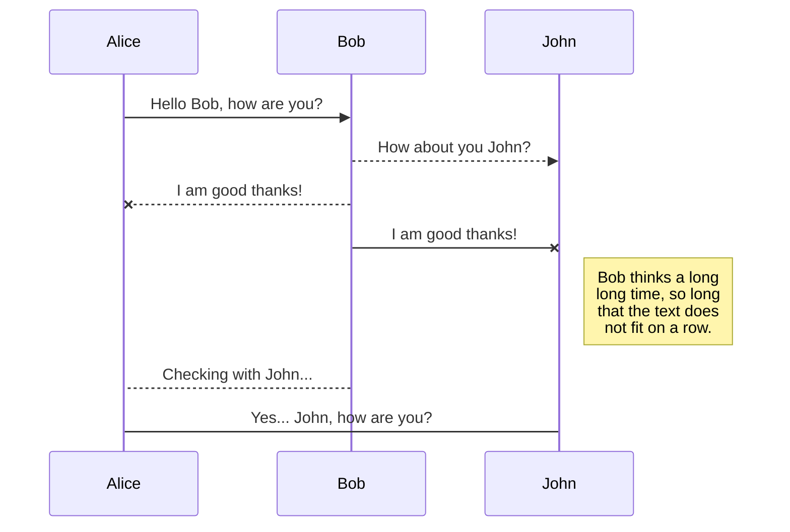
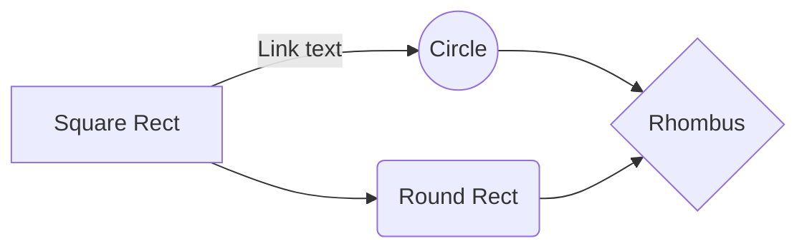

# Welcome to ClockUP!

This is a cloeck alarm for ........ desined by OAI7

# Design

- All software was made for **14x1** display, maybe not work for others displays. 
- Coneccions:
	- 1.  GND/Negative/0v.................GND
	- 2.  VCC.....................................5V
	- 3.  VO (Contrast)......................GND
	- 4.  Register Select (RS).............12
	- 5.  Read/Write (R/W).................GND
	- 6.  Clock (Enable).....................11
	- 11.  Bit 4..................................5
	- 12.  Bit 5..................................4
	- 13.  Bit 6..................................3
	- 14.  Bit 7..................................2
	- 15.  Backlight Anode (+)...........Specs recommend no more than 4.2V
	- 16.  Backlight Cathode (-).........GND

# Errors

- If have some problems when upload the sketch in **Ubuntu** try: `sudo chmod a+rw /dev/ttyACM0`

# Publication

Publishing in StackEdit makes it simple for you to publish online your files. Once you're happy with a file, you can publish it to different hosting platforms like **Blogger**, **Dropbox**, **Gist**, **GitHub**, **Google Drive**, **WordPress** and **Zendesk**. With [Handlebars templates](http://handlebarsjs.com/), you have full control over what you export.

> Before starting to publish, you must link an account in the **Publish** sub-menu.

# Markdown extensions

StackEdit extends the standard Markdown syntax by adding extra **Markdown extensions**, providing you with some nice features.

> **ProTip:** You can disable any **Markdown extension** in the **File properties** dialog.

## SmartyPants

SmartyPants converts ASCII punctuation characters into "smart" typographic punctuation HTML entities. For example:

|                |ASCII                          |HTML                         |
|----------------|-------------------------------|-----------------------------|
|Single backticks|`'Isn't this fun?'`            |'Isn't this fun?'            |
|Quotes          |`"Isn't this fun?"`            |"Isn't this fun?"            |
|Dashes          |`-- is en-dash, --- is em-dash`|-- is en-dash, --- is em-dash|

## KaTeX

You can render LaTeX mathematical expressions using [KaTeX](https://khan.github.io/KaTeX/):

The *Gamma function* satisfying $\Gamma(n) = (n-1)!\quad\forall n\in\mathbb N$ is via the Euler integral

$$
\Gamma(z) = \int_0^\infty t^{z-1}e^{-t}dt\,.
$$

> You can find more information about **LaTeX** mathematical expressions [here](http://meta.math.stackexchange.com/questions/5020/mathjax-basic-tutorial-and-quick-reference).

## UML diagrams

You can render UML diagrams using [Mermaid](https://mermaidjs.github.io/). For example, this will produce a sequence diagram:

And this will produce a flow chart:

